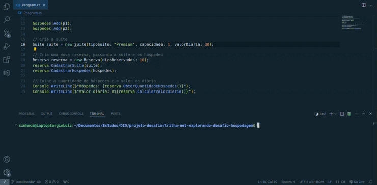

# DIO - Trilha .NET - Explorando a linguagem C#
www.dio.me

## Desafio de projeto
Para este desafio, você precisará usar seus conhecimentos adquiridos no módulo de explorando a linguagem C#, da trilha .NET da DIO.

## Contexto
Você foi contratado para construir um sistema de hospedagem, que será usado para realizar uma reserva em um hotel. Você precisará usar a classe Pessoa, que representa o hóspede, a classe Suíte, e a classe Reserva, que fará um relacionamento entre ambos.

O seu programa deverá cálcular corretamente os valores dos métodos da classe Reserva, que precisará trazer a quantidade de hóspedes e o valor da diária, concedendo um desconto de 10% para caso a reserva seja para um período maior que 10 dias.

## Regras e validações
1. Não deve ser possível realizar uma reserva de uma suíte com capacidade menor do que a quantidade de hóspedes. Exemplo: Se é uma suíte capaz de hospedar 2 pessoas, então ao passar 3 hóspedes deverá retornar uma exception.
2. O método ObterQuantidadeHospedes da classe Reserva deverá retornar a quantidade total de hóspedes, enquanto que o método CalcularValorDiaria deverá retornar o valor da diária (Dias reservados x valor da diária).
3. Caso seja feita uma reserva igual ou maior que 10 dias, deverá ser concedido um desconto de 10% no valor da diária.

## Solução
Minhas implementações na resolução deste desafio, garantindo que as funcionalidades principais do sistema funcionassem corretamente.

### Versão da Plataforma
- Este projeto foi desenvolvido utilizando a plataforma `.NET versão 8`.

## Implementações Realizadas
**1. Cadastrar Hóspedes**

- **Problema resolvido:** Verifiquei se a capacidade da suíte era maior ou igual ao número de hóspedes antes de cadastrá-los.

- **Implementação:** Se a capacidade da suíte fosse suficiente, os hóspedes eram cadastrados corretamente. Caso contrário, uma exceção era lançada com a mensagem `"A quantidade de hóspedes não pode exceder a capacidade da suíte."`.

**2. Obter Quantidade de Hóspedes**

- **Problema resolvido:** Retornei a quantidade de hóspedes cadastrados.

- **Implementação:** Utilizei a propriedade `Hospedes.Count` para retornar o número total de hóspedes.

**3. Calcular Valor da Diária**

- **Problema resolvido:**  Implementei o cálculo do valor da diária baseado na quantidade de dias reservados.

- **Implementação:** O cálculo utilizado foi `DiasReservados * Suite.ValorDiaria`.

- **Desconto:** Apliquei um desconto de 10% no valor total caso o número de dias reservados fosse maior ou igual a 10.

## Demonstração do Sistema

Aqui está uma breve demonstração em vídeo do sistema em execução: 

 

    
 
